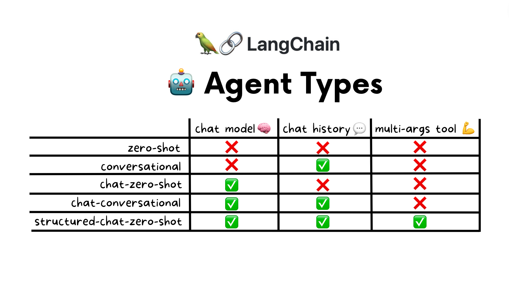

<p align="center">  
  
</p>

<h3 align="center"> Elevate Your Project with Top-Tier AI/LLM Expertise! 🚀 </h3>

<p align="center">
  <b>Daceflow AI</b> <br>
  <a href="http://daceflow.ai">Unlock Possibilities →</a> <br>
  📧 Connect with us: <a href="mailto:edrick@daceflow.ai">edrick@daceflow.ai</a>
</p>

# 🦜🔗 LangChain Agents




## 👷️ Overview

Link: https://youtu.be/1AmLD1aY7cM

This overview describes LangChain's agents in 9 minutes and is packed with examples and animations to get the main points across as simply as possible.


## 💻 Getting Started

### Prerequisites

You will need Python and Pipenv

### API Keys

You will need
- [OpenAI](https://platform.openai.com/) key (LLM)
- [SERPApi](https://serpapi.com/) key (Browsing the web)

Your .env file should look like
``` bash
OPENAI_API_KEY="XXXXX"
SERPAPI_API_KEY="XXXXX"
```

### Gmail Auth

You will need a credentials.json file to let the agent send emails. You can create yours at https://developers.google.com/gmail/api/quickstart/python#authorize_credentials_for_a_desktop_application 

### Installation

1. Clone the repository:

```bash
git clone https://github.com/edrickdch/langchain-agents
```

2. Navigate to the project directory:

```bash
cd langchain-agents
```

3. Install the required dependencies using Pipenv:

```bash
pipenv install
```

4. Activate the Pipenv shell:

```bash
pipenv shell
```

5. Create a .env file in the top-directory with the following:
``` bash
OPENAI_API_KEY="XXXXX"
SERPAPI_API_KEY="XXXXX"
```


6. (OPTIONAL: For the sales report agent) Populate the DB

```bash
python src/agent/sales-report-db-starter.py
```

7. (OPTIONAL: For the sales report agent) Run the agent

```bash
python src/agent/sales-report-agent.py
```

## 🔗 Useful Links

- LangChain: https://python.langchain.com/docs/modules/agents/
- ReAct Paper: https://arxiv.org/abs/2210.03629 
- MRKL Paper: https://www.ai21.com/blog/jurassic-x-crossing-the-neuro-symbolic-chasm-with-the-mrkl-system
- Self-ask with search Paper: https://python.langchain.com/docs/modules/agents/agent_types/self_ask_with_search 
- BabyAGI: https://github.com/yoheinakajima/babyagi
- Generative Agents Paper: https://arxiv.org/abs/2304.03442
- Plan-and-solver Paper: https://github.com/AGI-Edgerunners/Plan-and-Solve-Prompting
  
  

## 💌 Newsletter

👇 Subscribe to the newsletter if you're interested in building more AI applications 

https://practical-ai-builder.beehiiv.com/
